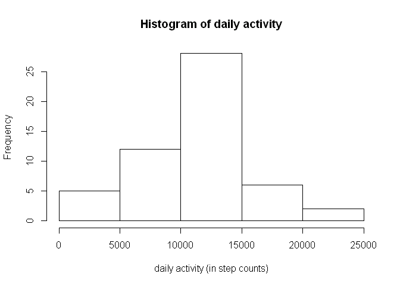

# Reproducible research - Peer assessment 1
yanfri  
Sunday, November 16, 2014  

## Abstract

This document describes the steps to answer the questions ased for the 1st peer assessment of the course on reproducible research at Johns Hopkins, resp. Coursera.org.

First, the git hub repository [https://github.com/rdpeng/RepData_PeerAssessment1](https://github.com/rdpeng/RepData_PeerAssessment1) was forked to my [personal github account](https://github.com/yanfri/RepData_PeerAssessment1). This repo was then cloned to my personal computer using the command `git clone https://github.com/yanfri/RepData_PeerAssessment1.git`

## Loading and preprocessing the data
The data have been transferred with the entire forked rep and are in the file "activity.zip".

The data was read into the variable `d.activity`.

```r
d.activity <- read.csv(unzip("activity.zip"))
```

The structure of the data was analyzed with the following commands:

```r
head(d.activity)
```

```
##   steps       date interval
## 1    NA 2012-10-01        0
## 2    NA 2012-10-01        5
## 3    NA 2012-10-01       10
## 4    NA 2012-10-01       15
## 5    NA 2012-10-01       20
## 6    NA 2012-10-01       25
```

```r
summary(d.activity)
```

```
##      steps               date          interval   
##  Min.   :  0.0   2012-10-01:  288   Min.   :   0  
##  1st Qu.:  0.0   2012-10-02:  288   1st Qu.: 589  
##  Median :  0.0   2012-10-03:  288   Median :1178  
##  Mean   : 37.4   2012-10-04:  288   Mean   :1178  
##  3rd Qu.: 12.0   2012-10-05:  288   3rd Qu.:1766  
##  Max.   :806.0   2012-10-06:  288   Max.   :2355  
##  NA's   :2304    (Other)   :15840
```

```r
str(d.activity)
```

```
## 'data.frame':	17568 obs. of  3 variables:
##  $ steps   : int  NA NA NA NA NA NA NA NA NA NA ...
##  $ date    : Factor w/ 61 levels "2012-10-01","2012-10-02",..: 1 1 1 1 1 1 1 1 1 1 ...
##  $ interval: int  0 5 10 15 20 25 30 35 40 45 ...
```

The data appears to be in a tidy data format.

## What is mean total number of steps taken per day?
To answer this question, the number of steps per day had to be computed:


```r
daily.activity <- aggregate(steps ~date, data = d.activity, sum)
```

A histogram of the data was created to represent the distribution of steps taken by day:

```r
# distribution and calculation of average and median of steps/day
hist(daily.activity$steps)
```

 


```r
# distribution and calculation of average and median of steps/day
avg <- mean(daily.activity$steps, na.rm = T)
med <- median(daily.activity$steps, na.rm = T)
```

The mean steps/day was 1.0766 &times; 10<sup>4</sup> and the median was 10765.


## What is the average daily activity pattern?


## Imputing missing values


## Are there differences in activity patterns between weekdays and weekends?
