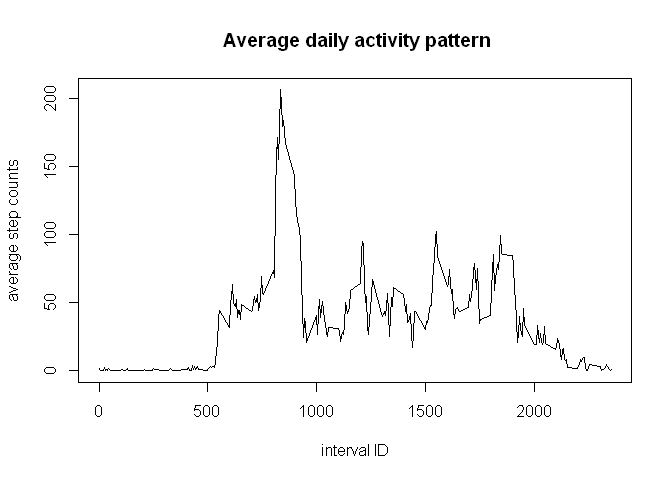

# Reproducible research - Peer assessment 1
yanfri  
Sunday, November 16, 2014  

## Abstract

This document describes the steps to answer the questions ased for the 1st peer assessment of the course on reproducible research at Johns Hopkins, resp. Coursera.org.

First, the git hub repository [https://github.com/rdpeng/RepData_PeerAssessment1](https://github.com/rdpeng/RepData_PeerAssessment1) was forked to my [personal github account](https://github.com/yanfri/RepData_PeerAssessment1). This repo was then cloned to my personal computer using the command `git clone https://github.com/yanfri/RepData_PeerAssessment1.git`

## Loading and preprocessing the data
The data have been transferred with the entire forked rep and are in the file "activity.zip".

The data was read into the variable `d.activity`.

```r
d.activity <- read.csv(unzip("activity.zip"))
```

The structure of the data was analyzed with the following commands:

```r
head(d.activity)
```

```
##   steps       date interval
## 1    NA 2012-10-01        0
## 2    NA 2012-10-01        5
## 3    NA 2012-10-01       10
## 4    NA 2012-10-01       15
## 5    NA 2012-10-01       20
## 6    NA 2012-10-01       25
```

```r
summary(d.activity)
```

```
##      steps               date          interval   
##  Min.   :  0.0   2012-10-01:  288   Min.   :   0  
##  1st Qu.:  0.0   2012-10-02:  288   1st Qu.: 589  
##  Median :  0.0   2012-10-03:  288   Median :1178  
##  Mean   : 37.4   2012-10-04:  288   Mean   :1178  
##  3rd Qu.: 12.0   2012-10-05:  288   3rd Qu.:1766  
##  Max.   :806.0   2012-10-06:  288   Max.   :2355  
##  NA's   :2304    (Other)   :15840
```

```r
str(d.activity)
```

```
## 'data.frame':	17568 obs. of  3 variables:
##  $ steps   : int  NA NA NA NA NA NA NA NA NA NA ...
##  $ date    : Factor w/ 61 levels "2012-10-01","2012-10-02",..: 1 1 1 1 1 1 1 1 1 1 ...
##  $ interval: int  0 5 10 15 20 25 30 35 40 45 ...
```

The data appears to be in a tidy data format.

## What is mean total number of steps taken per day?
To answer this question, the number of steps per day had to be computed with:


```r
daily.activity <- aggregate(steps ~ date, data = d.activity, sum)
```

A histogram of the data was created to represent the distribution of steps taken per day:

```r
# distribution and calculation of average and median of steps/day
hist(daily.activity$steps, main = "Histogram of daily activity", xlab = "daily activity (in step counts)")
```

 


```r
# distribution and calculation of average and median of steps/day
avg <- mean(daily.activity$steps, na.rm = T)
med <- median(daily.activity$steps, na.rm = T)
```

The **mean** steps/day was **1.0766 &times; 10<sup>4</sup>** and the **median** was **10765**.


## What is the average daily activity pattern?

The average daily activity is obtained by taking the average number of steps at every single interval over all day that have been monitored for this study:

```r
avgDailyPattern <- aggregate(steps ~ interval, data = d.activity, mean)
```

This activity pattern can be represented by a time series plot:

```r
plot(avgDailyPattern,  main = " Average daily activity pattern", xlab = "interval ID", ylab = "average step counts", type = "l")
```

 

```r
# identification of the interval with the highest daily average number of steps
maxSteps <- max(avgDailyPattern$steps)
maxInterval <- avgDailyPattern$interval[which.max(avgDailyPattern$steps)]
```

The interval at **835 minutes** is the 5-minutes interval with the highest step count of **206.1698 steps** taken on a daily average. 


## Imputing missing values

To investigate how many missing values (NA) the data set contains, the number of missing entries were counted in the different columns:


```r
intervalNA <- sum(is.na(d.activity$date))
dateNA <- sum(is.na(d.activity$interval))
stepsNA <- sum(is.na(d.activity$steps))
```

 1. interval: 0 missing values
 2. date: 0 missing values
 3. steps: 2304 missing values

The dataset contains 2304 missing values as NA.


## Are there differences in activity patterns between weekdays and weekends?


